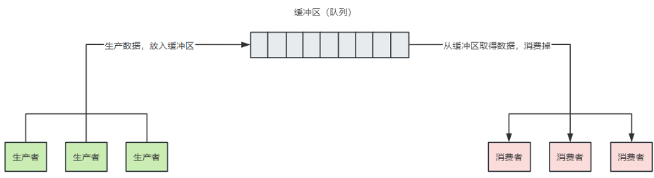

# 生产者消费者模型

## 1、什么是生产者消费者模型？

生产者消费者模型:
> 该模型存在三个关键的成员  
> - 生产者： 负责生产数据
> - 缓冲区（队列）：用于暂时存放数据
> - 消费者：负责消费生产者生产存放在缓冲区的数据

该模型的同步互斥关系如下：

- 生产者之间互斥
- 消费者之间互斥
- 生产者与消费者之间即同步又互斥  

> 这样理解最后一句话呢？  
>- 首先生产者与消费者之间是可以同步进行的，即可以一边生产一边消费。
>- 其次两者之间又必须是互斥的，缓冲区满时，只能消费完再生产缓冲区空时，
只能生产完再消费。
>- 二者必须同时满足。

## 2、生产者消费者的优点
1. 一定程度上提高代码的执行效率，弥补两者之间的运行效率，
> 若只能生产一个消费一个，这样当其中一个的效率较慢，从而会影响另外一个的效率。
> 另外从多线程并发的角度思考，会提高程序的效率  

2. 解耦
> 生产者和消费者之间不存在直接联系，代码不会相互影响或入侵
## 3、代码层面实现思路
思考：  
1. 模型中出现的身份或角色分别为生产者、消费者、缓冲区，其中缓冲区为共享资源，既然出现共享资源就需要考虑到线程安全问题
2. 缓冲区域需要满足一方进一方出的特性，不能随意被访问（队列）
3. 代码的抽象：按照模型出现的角色分别抽象成三个类：生产者线程类、消费者线程类、缓冲区资源类  
其中：  
缓冲资源类：负责维护一个缓冲区，并提供一个生产资源的方法，一个消费资源的方法（互斥）
生产者：负责向缓冲区中生产资源
消费者：负责通过缓冲区资源类提供的方法消费资源  
## 4、实现一： 适用java的synchronized、wait（）、notify（）
```java
// 资源类
public class BufferResource {
    /**
     * 缓冲区的最大容量capacity
     */
    private static final int MAX_CAPACITY = 10;
    /**
     * 缓冲区域
     */
    private  Queue<Integer> queue;

    /**
     * 创建对象时，必须指定队列
     *
     * @param queue 队列
     */
    public BufferResource(Queue<Integer> queue) {
        this.queue =queue;
    }

    /**
     * <p>
     * 消费者方法
     * </p>
     *
     * @author ao.chen02@hand-china.com 2025/2/5 17:05
     */
    public synchronized void consume() {
        // 如果缓冲区中没有数据则等待
        while (queue.isEmpty()) {
            System.out.println(Thread.currentThread().getName() + "当前缓冲区为空，等待生产。。。");
            try {
                wait();
            } catch (InterruptedException e) {
                throw new RuntimeException(e);
            }
        }

        // 消费数据
        Integer poll = queue.remove();
        System.out.println(Thread.currentThread().getName() + "消费成功，消费内容：" + poll+",当前缓冲区大小："+queue.size());
        notifyAll();
    }

    public synchronized void product(Integer value) {
        while (queue.size() == MAX_CAPACITY) {
            System.out.println(Thread.currentThread().getName() + "当前缓冲区已满，等待消费。。。。");
            try {
                wait();
            } catch (InterruptedException e) {
                throw new RuntimeException(e);
            }
        }

        // 生产数据
        queue.add(value);
        // 生产的时候增加点延迟。。模拟生产会影响到消费
        try {
            Thread.sleep(1000);
        } catch (InterruptedException e) {
            throw new RuntimeException(e);
        }
        System.out.println(Thread.currentThread().getName() + "生产成功，生产数据：" + value+",当前缓冲区大小："+queue.size());
        notifyAll();
    }

}  

```
```java
// 生产者
public class Producter extends Thread {
    private BufferResource buffer;
    Random rand = new Random();

    /**
     * 创建生产者时，必须指定缓冲区
     *
     * @param buffer 缓冲区
     */
    public Producter(BufferResource buffer) {
        this.buffer = buffer;
    }

    @Override
    public void run() {
        this.buffer.product(rand.nextInt(100));
    }
}
```  
```java
// 消费者
public class Consumer extends Thread {
    private BufferResource buffer;

    /**
     * 创建消费者对象时，必须指定缓冲区
     *
     * @param buffer  缓冲区
     */
    public Consumer(BufferResource buffer) {
        this.buffer = buffer;
    }

    @Override
    public void run() {
        this.buffer.consume();
    }
}
```
```java
// 测试代码
private static void test01() {
    // 创建缓冲区
    BufferResource resource = new BufferResource(new LinkedList<>());

    // 分别创建10个消费者和生产者进行生产和消费
    for (int i = 0; i < 10; i++) {
        new Producter(resource).start();
    }

    for (int i = 0; i < 10; i++) {
        new Consumer(resource).start();
    }
}
```

