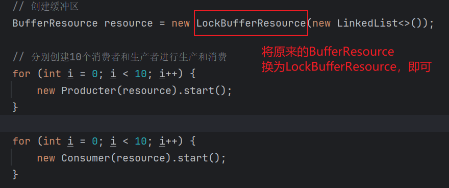

# 生产者消费者模型

## 1、什么是生产者消费者模型？

生产者消费者模型:
> 该模型存在三个关键的成员  
> - 生产者： 负责生产数据
> - 缓冲区（队列）：用于暂时存放数据
> - 消费者：负责消费生产者生产存放在缓冲区的数据

该模型的同步互斥关系如下：

- 生产者之间互斥
- 消费者之间互斥
- 生产者与消费者之间即同步又互斥  

> 这样理解最后一句话呢？  
>- 首先生产者与消费者之间是可以同步进行的，即可以一边生产一边消费。
>- 其次两者之间又必须是互斥的，缓冲区满时，只能消费完再生产缓冲区空时，
只能生产完再消费。
>- 二者必须同时满足。

## 2、生产者消费者的优点
1. 一定程度上提高代码的执行效率，弥补两者之间的运行效率，
> 若只能生产一个消费一个，这样当其中一个的效率较慢，从而会影响另外一个的效率。
> 另外从多线程并发的角度思考，会提高程序的效率  

2. 解耦
> 生产者和消费者之间不存在直接联系，代码不会相互影响或入侵
## 3、代码层面实现思路
思考：  
1. 模型中出现的身份或角色分别为生产者、消费者、缓冲区，其中缓冲区为共享资源，既然出现共享资源就需要考虑到线程安全问题
2. 缓冲区域需要满足一方进一方出的特性，不能随意被访问（队列）
3. 代码的抽象：按照模型出现的角色分别抽象成三个类：生产者线程类、消费者线程类、缓冲区资源类  
其中：  
缓冲资源类：负责维护一个缓冲区，并提供一个生产资源的方法，一个消费资源的方法（互斥）
生产者：负责向缓冲区中生产资源
消费者：负责通过缓冲区资源类提供的方法消费资源  
4. 代码的复用：这里对缓冲资源类中的的两个关键方法（生产和消费）和相关数据资源进行封装形成抽象类。
## 4、抽象缓冲资源类的定义
```java
/**
 * <p>
 * description 缓冲抽象资源类
 * </p>
 *
 * @author ao.chen02@hand-china.com
 */
public abstract class BufferResource {
    /**
     * 缓冲区的最大容量capacity
     */
    public static final int MAX_CAPACITY = 10;
    /**
     * 简单数据缓冲区域
     */
    private Queue<Integer> simpleBuffer;

    /**
     * 阻塞队列缓冲区域
     */
    private BlockingQueue<Integer> blockingBuffer;
    
    /**
     * <p> 
     *  消费者方法（由子类进行实现）
     * </p>
     *
     * @author ao.chen02@hand-china.com 2025/2/6 16:37
     */
    public abstract void consume();

    /**
     * <p> 
     *   生产者方法(由子类进行实现)
     * </p>
     *
     * @param value
     * @author ao.chen02@hand-china.com 2025/2/6 16:40
     */
    public abstract void  product(Integer value);

    // getter/setter方法
    public Queue<Integer> getSimpleBuffer() {
        return simpleBuffer;
    }

    public void setSimpleBuffer(Queue<Integer> simpleBuffer) {
        this.simpleBuffer = simpleBuffer;
    }

    public BlockingQueue<Integer> getBlockingBuffer() {
        return blockingBuffer;
    }

    public void setBlockingBuffer(BlockingQueue<Integer> blockingBuffer) {
        this.blockingBuffer = blockingBuffer;
    }
}
```
## 5、定义生产者和消费者线程类
```java
/**
 * <p>
 * description 消费者线程
 * </p>
 *
 * @author ao.chen02@hand-china.com
 */
public class Consumer extends Thread {
    private BufferResource buffer;

    /**
     * 创建消费者对象时，必须指定缓冲区
     *
     * @param buffer  缓冲区
     */
    public Consumer(BufferResource buffer) {
        this.buffer = buffer;
    }

    @Override
    public void run() {
        this.buffer.consume();
    }
}
```  
```java
/**
 * <p>
 * description 生产者线程
 * </p>
 *
 * @author ao.chen02@hand-china.com
 */
public class Producter extends Thread {
    private BufferResource buffer;
    Random rand = new Random();

    /**
     * 创建生产者时，必须指定缓冲区
     *
     * @param buffer 缓冲区
     */
    public Producter(BufferResource buffer) {
        this.buffer = buffer;
    }

    @Override
    public void run() {
        this.buffer.product(rand.nextInt(100));
    }
}
```
## 6、实现一： 使用java的synchronized、wait（）、notifyAll（）
```java
/**
 * <p>
 * description 缓冲资源类；采用synchronized+wait()+notifyAll()
 * </p>
 *
 * @author ao.chen02@hand-china.com
 */
public class ObjectBufferResource extends BufferResource {


    /**
     * 创建对象时，必须指定队列
     *
     * @param queue 队列
     */
    public ObjectBufferResource(Queue<Integer> queue) {
        super.setSimpleBuffer(queue);
    }

    /**
     * <p>
     * 消费者方法
     * </p>
     *
     * @author ao.chen02@hand-china.com 2025/2/5 17:05
     */
    @Override
    public void consume() {
        synchronized(this){
            // 如果缓冲区中没有数据则等待
            while (super.getSimpleBuffer().isEmpty()) {
                System.out.println(Thread.currentThread().getName() + "当前缓冲区为空，等待生产。。。");
                try {
                    wait();
                } catch (InterruptedException e) {
                    throw new RuntimeException(e);
                }
            }

            // 消费数据
            Integer poll = super.getSimpleBuffer().remove();
            System.out.println(Thread.currentThread().getName() + "消费成功，消费内容：" + poll+",当前缓冲区大小："+super.getSimpleBuffer().size());
            notifyAll();
        }
    }

    @Override
    public void product(Integer value) {
        synchronized(this){
            while (super.getSimpleBuffer().size() == MAX_CAPACITY) {
                System.out.println(Thread.currentThread().getName() + "当前缓冲区已满，等待消费。。。。");
                try {
                    wait();
                } catch (InterruptedException e) {
                    throw new RuntimeException(e);
                }
            }

            // 生产数据
            super.getSimpleBuffer().add(value);
            // 生产的时候增加点延迟。。模拟生产会影响到消费
            try {
                Thread.sleep(1000);
            } catch (InterruptedException e) {
                throw new RuntimeException(e);
            }
            System.out.println(Thread.currentThread().getName() + "生产成功，生产数据：" + value+",当前缓冲区大小："+super.getSimpleBuffer().size());
            notifyAll();
        }
    }
}
```

```java
// 测试代码
private static void test01() {
    // 创建缓冲区
    BufferResource resource = new BufferResource(new LinkedList<>());

    // 分别创建10个消费者和生产者进行生产和消费
    for (int i = 0; i < 10; i++) {
        new Producter(resource).start();
    }

    for (int i = 0; i < 10; i++) {
        new Consumer(resource).start();
    }
}
```

## 7、实现二：使用Lock+condition    
> 这里采用继承的方式实现BufferSource代码的复用

```java
/**
 * <p>
 * description 缓冲资源类：采用lock+condition
 * </p>
 *
 * @author ao.chen02@hand-china.com
 */
public class LockBufferResource extends BufferResource {

    // 创建锁
    private final Lock lock = new ReentrantLock();

    //生产者对应的Condition
    private final Condition producerCondition = lock.newCondition();

    // 消费者对应的Condition
    private final Condition consumerCondition = lock.newCondition();

    /**
     * 创建对象时，必须指定队列
     *
     * @param queue 队列
     */
    public LockBufferResource(Queue<Integer> queue) {
        super.setSimpleBuffer(queue);
    }

    // 重写父类的生产和消费方法
    @Override
    public void consume() {
        // 获取锁
        lock.lock();
        try {
            while (super.getSimpleBuffer().isEmpty()) {
                System.out.println(Thread.currentThread().getName() + " 当前缓冲区为空，等待生产中...");
                consumerCondition.await();

            }
            // 进行消费
            Integer value = super.getSimpleBuffer().remove();
            System.out.println(Thread.currentThread().getName() + " 消费成功：" + value.toString() +
                    " 当前缓冲区size = " + super.getSimpleBuffer().size());
            // 消费完后只唤醒生产者
            producerCondition.signalAll();
        } catch (Exception e) {
            throw new RuntimeException(e);
        } finally {
            // 释放锁
            lock.unlock();
        }
    }

    @Override
    public void product(Integer value) {
        lock.lock();
        try {
            // 判断队列是否已满
            while (super.getSimpleBuffer().size() == MAX_CAPACITY) {
                System.out.println(Thread.currentThread().getName() + "当前缓冲区已满，等待消费...");
                producerCondition.await();
            }

            // 生产数据
            super.getSimpleBuffer().add(value);
            System.out.println(Thread.currentThread().getName()+"生产成功："+value.toString()
                    +" 当前缓冲区size = " + super.getSimpleBuffer().size());
            // 生产完毕，只唤醒消费者
            consumerCondition.signalAll();
        }catch (InterruptedException e) {
            throw new RuntimeException(e);
        }finally {
            // 释放锁资源
            lock.unlock();
        }
    }
}


```  
> 测试时，只需更换测试方法的缓冲区对象即可进行测试，其余代码无需修改
  
## 8、实现三：使用阻塞队列
> 前面的两种方式中使用的队列是LinkedList结合锁进行模型的实现，其实有一个队列可以让我们不用手动使用锁机制
> 即:LinkedBlockingQueue  
> 该数据结构的底层实现了同步操作即：
> - 如果队列已满，再进行插入则会阻塞，直到队列不满才会被唤醒，然后才能插入
> - 如果队列为空，再进行删除也会进入阻塞，直到队列不为空才被唤醒，然后才能删除  
> 从而，我们不再需要手动实现代码的同步
```java
/**
 * <p>
 * description 缓冲资源类：使用BlockingQueue
 * </p>
 *
 * @author ao.chen02@hand-china.com
 */
public class BlockingQueueBufferResource extends BufferResource {


    /**
     * 构造方法-必须设置阻塞队列缓冲区
     *
     * @param buffer 缓冲区
     */
    public BlockingQueueBufferResource(BlockingQueue<Integer> buffer) {
        super.setBlockingBuffer(buffer);
    }

    @Override
    public void consume() {
        try{
            Integer take = super.getBlockingBuffer().take();
            System.out.println(Thread.currentThread().getName() + " 消费成功：" + take + " 当前缓冲区size = " +  super.getBlockingBuffer().size());
        }catch (InterruptedException e){
            throw new RuntimeException(e);
        }
    }

    @Override
    public void product(Integer value) {
        try{
            super.getBlockingBuffer().put(value);
            System.out.println(Thread.currentThread().getName() + " 生产成功：" + value + " 当前缓冲区size = " +  super.getBlockingBuffer().size());
        }catch (InterruptedException e){
            throw new RuntimeException(e);
        }
    }
}


```
> 测试和之前一样只需更换对象即可
> 
> 其余内容不变
## 9、分析
上面两三种方式：分别采用java不同形式的同步方式进行实现，其中:

第一种方式：使用Object对象的wait（）、notifyAll（）方法与synchronized关键字语法，可以发现其中有个问题
是notifyAll()会唤醒所有的线程（包括生产者和消费者线程），但这样是不合理的，例如一个生产者线程生产完后只需要唤醒消费者线程组就行了，
并不需要唤醒其他的生产者线程。  

第二种方式：使用juc中的Lock和condition方式，将唤醒的粒度缩小到具体的线程组，有效的解决了方式一所产生的问题。  

第三种方式：使用juc中的LinkedBlockingQueue队列作为缓冲区，避免手动实现同步代码