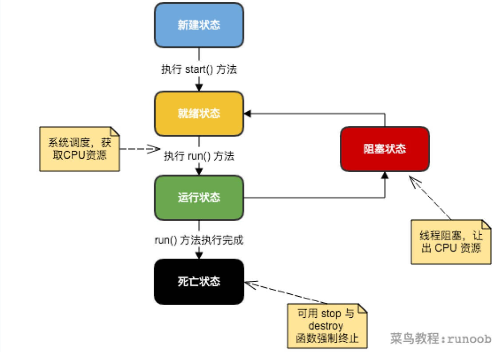

## 什么是线程的声明周期？
> 线程的生命周期是指：一条线程从创建-运行-死亡的整个过程。在整个过程中线程可能需要经历以下五个过程：
> - 新建（New）
> - 就绪（Runnable）也可称为：可运行
> - 运行（Running）
> - 阻塞（Blocked）
> - 死亡（Dead）  
> 状态之间的转换如下所示：

## 新建（New）
当程序运行到 new 关键字创建一个线程后，此时的线程状态就属于新建状态，
此时的线程对象和其他对象一样，仅在虚拟机中分配内存，并初始化相关成员变量值，并不会立即运行线程。
> 使用Thread类的getStatus()可以查看当前线程的状态
```java
public class XThread extends Thread {
    @Override
    public void run() {
        System.out.println("线程运行中。。。");
    }
}

```
```java
private static void test() {
    // 此时线程属于：创建状态
    Thread example = new XThread();
    System.out.println(example.getState());
}

```
可以运行程序，发现线程的运行结果为：NEW,即线程创建状态
## 就绪（Runnable）
当程序运行到Thread.start()方法后，线程就处于就绪状态。,此时虚拟机就会为该线程创建一个栈和程序计数器，
并且CUP可以调度运行该线程了。线程状态从创建->就绪
> 注意: 这里说的是CPU可以调度运行该线程，并不是指该线程运行了，具体什么时候运行，
> 由操作系统调度决定。当操作系统给该线程分配了时间片后才可以运行
## 运行（Running）
当操作系统调度选中该线程后（即给该线程分配了CPU执行时间），
该线程就可运行，线程状态从就绪->运行
> 注意：这里线程运行过程中可能会阻塞，也可能直接运行完成。
> 下面我们先介绍线程运行成功后的状态  

## 死亡（Dead）
当一个线程出现以下三种情况时，线程就会结束，结束后的状态就处于死亡状态。线程状态从运行-结束
1. run()方法执行完成。线程正常结束。
2. 线程运行过程中，抛出一个未捕获的异常（Exception）或错误（Error）。
3. 线程运行过程中，运行到手动调用stop()方法，该线程就会结束
> 死亡状态的线程不能再运行，必须重新加载内存后才能运行
## 阻塞（Blocked）
当一个运行状态的线程因为某些原因放弃使用CPU使用权时，将暂时停止运行进入阻塞状态。可能的原因如下：
1. 等待阻塞：运行的线程执行过程中遇到wait()方法，JVM会把该线程加入到线程等待池中（注：wait()会释放线程持有的锁）
2. 同步阻塞：运行的线程在获取同步锁时，若该同步锁被其他线程占用，则JVM会把该线程加入到锁池中。
3. 其他阻塞：当出现线程执行到sleep()或join()方法、发生IO请求超时等，JVM会把线程设置为阻塞状态。
> 注意:线程进入阻塞状态后，需要重新运行时，必须经过就绪状态等待CUP分配时间后执行，需重新走就绪-运行-死亡的流程线。不能直接从阻塞状态到运行状态
## 几个线程阻塞的相关概念
### 线程睡眠：
Thead.sleep(long millis)方法，使线程转到阻塞状态，当睡眠结束后，就转为就绪状态。
### 线程等待
Object类中的wait()方法，导致当前的线程等待，进入等待池中，直到其他线程调用此对象的notify()或者notifyAll()方法后，才会唤醒该线程，转为就绪状态。
### 线程唤醒
这是相对于线程等待来说的，其中notify()会选择一个等待线程唤醒，选择是任意的，而notifyAll()则是唤醒全部的等待线程。
### 线程让步
Thread.yield()方法，会暂停当前正在执行的线程，将执行机会让给更高优先级的线程。特别注意：yield()方法不会释放锁
### 线程加入
join()方法，等待其他线程种植。在当前线程中调用另外一个线程的join()方法，则当前线程转入阻塞状态，直到另一个线程运行结束，当前线程再由阻塞状态转为就绪状态。
### 线程I/O
线程执行某些IO操作，因为等待相关的资源而进入阻塞状态，比如：监听system.in时，尚且没有收到键盘的输入，则进入阻塞状态。


